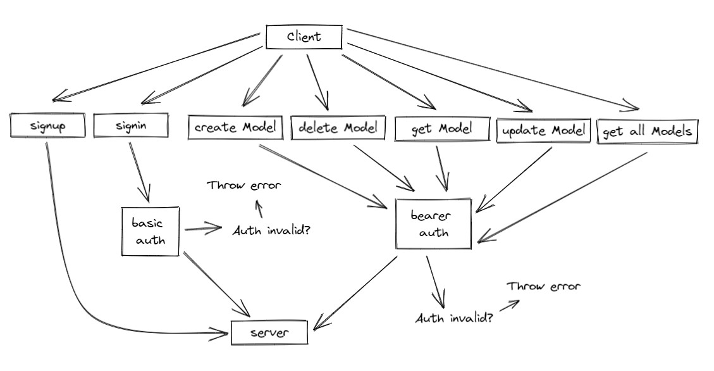

# [Heroku Link](https://dft-auth-api.herokuapp.com/)

# UML



# Install and Test Instructions

Step 1: Git clone [Repo Link](https://dftjr-basic-api-server.herokuapp.com)

Step 2: Install the nodes <code>npm i</code>

Step 3: Run the tests <code>npm test</code>

Step 4: Check to see that the code is passing, should look the the following picture below:

Step 5: Set-up your .env PORT path to whatever you prefer

Step 6: Start the server <code>nodemon</code>


# Notes Class 11: Event Driven Applications

Today, we will leverage the ability of Javascript to raise events, monitor events, and perform operations in response to events occurring.

## Learning Objectives

### Students will be able to

#### Describe and Define

- Events
- ... specifically, the Node event system
- Event driven architecture

#### Execute

- Implement the Observer pattern using Publish/Subscribe
- Create a modular, event based system.A

## Today's Outline

<!-- To Be Completed By Instructor -->

## Notes

### Event Driven Programming

Nearly everything in the world is "Event Driven"

Humans respond to events billions of times every day. Your eyes react to light. You hit the brakes when the car in front of you slows down. Your skin forms a blister when burned.

Machines can be event driven as well. Self driving cars can stay in their lane by "reading" the road lines in real time. Thermostats constantly turn the heat/air on or off in response to the temperature.

How can we leverage this in a software application?

- Everything in JS is an object
- Most actions in JS are event driven
  - UI Events
  - Express Routes
  - (soon) Model Lifecycle Hooks
  - (later) React ... everything
- Now, we harness that power

### Emitting Events

> **I just did something important and I want the whole world to know about it**

`express-server.js`

```javascript
let SQL = "DELETE FROM sometable WHERE id = $1"
let values = [request.query.id];
client.query(SQL, values)
  .then( results => {
    emit('delete', request.query.id);
    res.send('Record Deleted')
  });
```

> **Something happened that I need to care about and do something with**

`some-other-module.js`

```javascript
// Whenever the "delete" event has been emitted anywhere in my code base
// Run this function
events.on('delete', (data) => {
    sendEmail({
        to: 'admin@here.com',
        subject: 'Someone deleted part of the database',
        body: `Record id: ${data} was removed`
    });
});
```
